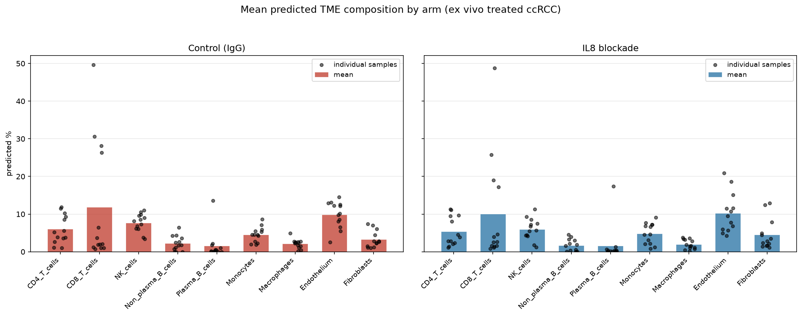
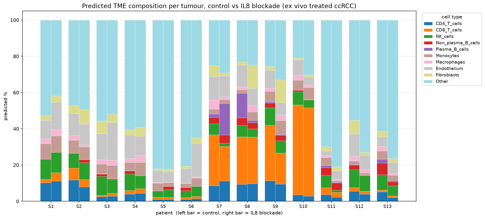
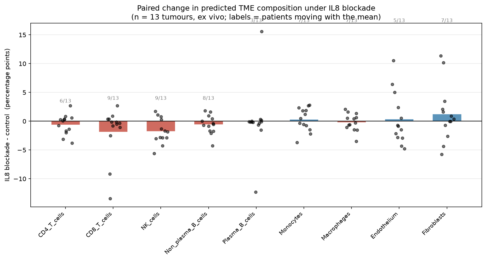

# Reproducing Kassandra: training a cell-type deconvolution model locally and applying it to a public tumor sample

This is a demonstration of BostonGene's cell deconvolution algorithm Kassandra using a publicly available data sample. In this document, I explain in brief each technical step of the process for reproduction: downloading the data, normalizing and formatting it for compatibility with Kassandra, and obtaining and using results.

The Kassandra algorithm and core/ implementation are by BostonGene. This repository contains my pipeline scripts, environment file, patches, documentation, and results. Licensing for the derived portions follows BostonGene's terms; see [license.md](license.md).

## Specs

This project was completed in its entirety on my Windows laptop. Microsoft Windows 11 Home, 32GB ram, 1 TB storage.

### Dependencies

I installed:
- SRA Toolkit
- Miniconda
- Kallisto (precompiled binary)
- Python

I cloned jsangalang's [Kassandra-modified](https://github.com/jsangalang/Kassandra-modified) repo and used its programs and code to complete my project. I moved the relevant data files from the [*official* Kassandra repo](https://github.com/BostonGene/Kassandra) into this cloned repo.

## Results

Running the prediction script using a trained model yields a cell percentage table .tsv file representing the predicted ratio of each cell type in the tumor microenvironment.

Using the program with the "GSE107572" example dataset (provided by Kassandra) yielded a plot to validate performance and data correctness:


BioProject PRJNA1405960 is associated with **26** bulk RNA-seq reads of ex vivo **clear cell renal cell carcinoma (ccRCC)** tumor cultures. 
> From NCBI SRA BioProject PRJNA1405960, sourced from Dong et al., *Clin Cancer Res* (2026) 32 (9): 1860–1873, DOI: [doi:10.1158/1078-0432.CCR-25-4384](https://doi.org/10.1158/1078-0432.CCR-25-4384)

Applying the same Kassandra pipeline to this data yielded the cell % prediction .tsv's. However, **actual cell content/cytometry was not provided** for these samples.

So when I found *that* out, I decided to look in a different direction to extract useful info from the data. I instead focused on the abstract from the BioProject, and how I can use this data to come to similar conclusions the researchers did. Or, at least, learn.

After deconvolution of the pairs of samples (n=13), I was able to generate plots placing predicted cell %s side-by-side:





These compare predicted TME composition between IgG control and IL8 blockade in the same tumors. Across the 13 pairs, **no cell type showed a consistent composition change under IL8 blockade**.



**The referenced study's actual result** was that "ex vivo IL8 blockade alleviated CD8+ T-cell exhaustion and synergized with PD-1 inhibition to enhance antitumor immune responses" (Dong et al., 2026). They used **mass/flow cytometry and multiomics** to gather insights, which provided different information than analyzing the RNA-seq data. This study highlights that transcriptomic analysis methods reveal TME composition information in their scope, and the study requires a different, more holistic approach to analyze immune suppression and cell state.

### Next questions

Can people be allergic to IL8 blockade? How expensive is it? Quantitatively, how much more effective is the immune system against ccRCC after IL8 blockade treatment, and how much does it improve patient survival chances?

### Limitations

The full publication model generates artificial transcriptomes in training. I reduced the number (300000 points to 3000 points) so my computer could handle it. So my results may not be as accurate.

The "Dendritic_cells" and "Granulocytes" cell types are not present in the training data. The fork removes these from the deconvolution, so they are not shown in the results.

The results are specifically for the *tumor* model.

Given that the experiments used samples *ex vivo*, interpretation of the results may not be accurate to *in vivo* (actual clinical practice).

## Process

This project follows a reproducible pipeline from raw sequencing reads to Kassandra deconvolution outputs. I documented my thought process, specific steps, and error fixes in lots of detail in [my personal log.](/lab_notebook.md)

### Overview

- Data acquisition: download SRA archive (SRR accession) and convert to FASTQ using the SRA Toolkit.
- Quantification: run `kallisto quant` with the `kallisto_hg38.idx` transcriptome index to produce TPMs in `abundance.tsv`.
- Preparation: convert transcript-level TPMs to gene-level TPMs and renormalize to Kassandra's expected format.
- Deconvolution: run the trained Kassandra model (local `models/tumor_model.pkl`) to produce cell composition percentages.

### 1) Data acquisition

I used the NCBI SRA database to selectively search for a bulk RNA-seq dataset from a tumor sample. I chose `SRX31879952` based on scan strategy, source, instrument, and other factors that most align with BostonGene's methods. `SRX31879952` is the experiment's searchable ID in the SRA database, and SRR36909580 is the accession number you need to download the sample with sratoolkit.

Example commands used in this project (SRR36909580):

```bash
prefetch SRR36909580
fasterq-dump SRR36909580/SRR36909580.sra --progress
```

After `fasterq-dump` you will have paired FASTQ files (e.g. `SRR36909580_1.fastq` and `SRR36909580_2.fastq`).

### 2) Kallisto quantification

Download the `kallisto_hg38.idx` index from the [CGL pipeline repository](https://www.synapse.org/Synapse:syn5882333/files/) and run:

```bash
kallisto quant -i kallisto_hg38.idx -o SRR36909580/output SRR36909580_1.fastq SRR36909580_2.fastq
```

The `SRR36909580/output` folder will contain `abundance.tsv`, `abundance.h5`, and `run_info.json`. `abundance.tsv` contains `target_id, length, eff_length, est_counts, tpm` columns and is the input for the next step.

### 3) Prepare TPM for Kassandra

Kassandra expects a gene expression TPM matrix in .tsv format. The matrix directly output from Kallisto is transcript-level TPM. The helper utilities in Kassandra's `core/` translate Kallisto's matrix to gene-level TPM. This repository **DOES NOT** include helper utilities used by the prediction script (`core.utils.tr_to_genes` and `core.utils.renorm_expressions`). Those are in the Kassandra-modified fork. 

To run with the supplied scripts:

1. Copy or move the `abundance.tsv` into the input path expected by the prediction script.

2. Make sure you also have the four training data files from BostonGene's [website](https://science.bostongene.com/kassandra/downloads), in the "Data used in model training" section.

### 4) Conda environment creation

A conda environment is necessary to ensure functionality across the programs requiring different package versions.

The Kassandra-modified fork provides a .yaml file for creating the conda environment. It's a Linux export and it's very specific, so I made my own .yaml (env-win.yaml) which works for my Windows environment. If you're using a Windows environment, use [my file](/env-win.yaml).

1. Download Miniconda (full Anaconda suite not necessary) to use the Anaconda Prompt application. 

2. Open Anaconda Prompt. Navigate to the project's repository and run:

```
conda env create -f env-win.yaml
```

> **Note:** Errors taking place during this process may require cleaning your cache and removing files created by these commands. You can do this with `conda clean --all` and `conda env remove -n kassandra`.


> **IMPORTANT:** Make sure **Code Fixes 2 and 3** are applied to their corresponding files (see [Code Fixes](#code-fixes)) before trying to run the python scripts. They fix bugs.

Activate the conda environment using `conda activate kassandra` to be able to use the Kassandra scripts through the Anaconda terminal.


### 5) Training and running Kassandra locally

> **IMPORTANT**: Kassandra's example ipynb for training a model generates 300,000 artificial transcriptomes. That would take a long time on an average laptop. I went to train_kassandra.py -> "Model training" -> the Mixer object, and changed num_points to around 3000.

- To train locally, use:

```bash
python scripts/train_kassandra.py
```

This will produce `models/tumor_model.pkl` used by the prediction script. Generating 3000 artificial transcriptomes generated a model on my device in ~4 minutes.


- Once you have a trained model available (`models/tumor_model.pkl`), `scripts/predict_kassandra.py` runs predictions and writes results to `output/deconvolution_percentages.tsv`.

### 6) Testing and validation

I validated my results by using Kassandra's provided performance testing dataset **GSE107572** as a point of reference. I compared the output plots of `test_kassandra.py` with the plots of GSE107572 in the Kassandra repo side-by-side.

### 7) Notes

- I made my own .yaml different from the one in the Kassandra-modified fork, for compatibility with my Windows device. I used mine to create my conda environment in this project.
- I changed the number of artificially generated transcriptomes in the model training step. This is to make the training program quick.

## Code Fixes:

### 1. **.yaml for conda environment**

I made [my own .yaml](/env-win.yaml) and used that instead of jsangalang's.

### 2. **core/plotting.py** - fixed plotting bug

line 99:

```python
    ax.grid(b=False)
```

**Changed** to:

```python
    ax.grid(False)
```

### 3. **core/cell_types.py** - fixed getattr to work with loaded pickle objects skipping initialization

line 116:

```python
        return self._types_dict[item]
```

**Changed** to:

```python
        # Fixed to work with unpickled trained model objects
        # The original code used self._types_dict, which didn't run __init__ when the object was unpickled. 
        try:
            types_dict = object.__getattribute__(self, '_types_dict')
        except AttributeError:
            raise AttributeError(item)
        try:
            return types_dict[item]
        except KeyError:
            raise AttributeError(item)
```

### 4. **Pickle/unpickle snippets** 

I added a snippet to store the trained model object as a .pkl file in models/ at the end of train_kassandra.py, and a snippet to load that object at the start of the other two scripts.